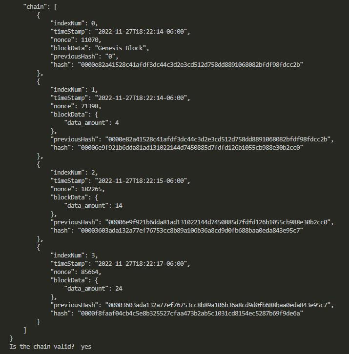
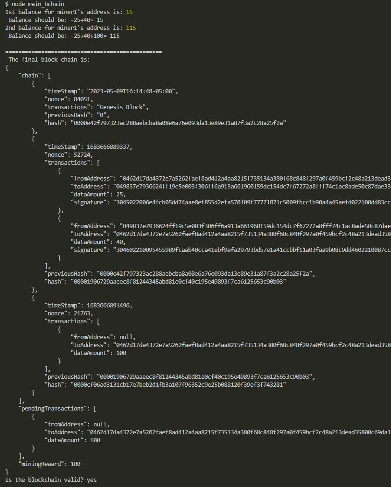

# Basic_Block_Chain

Richard Ay, (November 2022, *updated April/May 2023*)

## Table of Contents
* [Project Objective](#project-objective)
* [Technologies Used](#technologies-used)
* [Program Architecture](#program-architecture)
* [Block, Chain Description](#block-chain-description)
* [Program Usage](#program-usage)
* [Program Logic](#program-logic)
* [References](#references)
* [Application Screen Shots](#application-screen-shots)

## Project Objective
This program is an example of how to setup a block chain.  Details of a block chain (explained in the source code comments) include:
- what is a block
- what does a block contain
- what is a block chain
- how does security for the block/chain work
- how is the block chain verified

## Technologies Used
* The NPM package crypto-js for hashing functions.
* The NPM package moment for time/date functions.
* The NPM package elliptic for private/public key generation.
* The NPM package (dotenv) to utilize the '.env' file (to hide the public/private keys)

## Program Architecture
The main (driver) function can be found in "main_bchain.js".  The test code is also in this file.
The classes and their methods can be found in "block-chain.js".

The public/private keys necessary are generated by a secondary program - "keygenerator.js".  The ".env" file contains the public/private keys used in the main application.

## Block, Chain Description
A block chain is a sequence of blocks.  Each block contains its specific data (which can vary greatly by application), as well as the hash its data and the hash of the previous block.  It is the hash of the previous block that forms the "chain".  The hash of the previous block is "data" for the current block, so it contributes to the current block's hash value.  Additionally, a random value (the "nonce") is included in the block's data - such that the "nonce" value results in the block's hash starting with a specified number of zeros.  

## Program Usage
The application starts (from the command line with 'node main_bchain').
Public/Private keys can be generated from the command line with 'node keygenerator'.

## Program Logic
The first operation is the instantiation of a new 'block chain', which also creates the 'genesis' block.  The program then adds a number of "transactions", with hard-wired data to the chain.  As each transaction is created, it is signed and stored in a buffer, until it is added to a block (the "mining" activity). As each block is created, it's proper hash value is determined such that the hash begins with the nonce '0000'.  This is accomplished by incrementing the 'nonce' value until the resulting hash meets the '0000' criteria.  Additionally, the functions 'moment()' and 'Date.now()' are used to obtain the current date/time, used as the block's timestamp.

When a group of transactions are "mined" (added as a block to the chain), the mining activity rewards the 'miner' with 100 coins.  Any "wallets" associated are updated as a result of the transactions and mining activities.  The from/to addresses of the wallets in the transactions are the public keys of the participants.

The program then sends the wallet totals and the block chain to the terminal using 'console.log'.  The data can be visually verified proving the chain is valid.  

The initial code to test the block formation and validity checks is commented out.  The 'validate' function performs a series of checks on each block in the chain.  The checks performed are: the block's hash is recomputed to verify it is the correct value, the block's previous hash value is compared to the previous block, the block's hash is checked to verify it begins with '0000', the transactions are checked to verify they are signed properly.

## References
1) Block chain demo by Anders Brownworth: http://https://andersbrownworth.com/blockchain/
2) Creating a blockchain in JavaScript: https://www.youtube.com/watch?v=zVqczFZr124
   This is a series of videos:

   a) Block Chain basics

   b) Proof of Work (setting up the 'nonce')

   c) Rewards & Transactions

   d) signing transactions

   e) building a front-end (this video builds a new project in 'Angular', not implemented here)

3) Block chain Basics and Cryptography, MIT Open Courseware: http://https://www.youtube.com/watch?v=zVqczFZr124

## Application Screen Shots
  The initial output before transactions and signing.

 A completed block chain with transactions and signing.